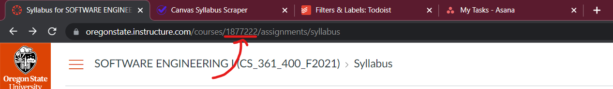

# Canvas to Todoist

This Python script utilizes the Canvas API and Todoist API to automatically transfer the tasks of a course hosted on Canvas into a new Todoist project.

## Getting Started

Follow the instructions below to get the application up and running locally.

## Installation

First, clone this repository:

```sh
$ git clone https://github.com/jasminjohal/canvas-to-todoist.git
$ cd canvas-to-todoist
```

_Before proceeding, I recommend setting up a [virtual environment](https://docs.python.org/3/library/venv.html)._

Install the dependencies:

```sh
$ pip install -r requirements.txt
```

## Usage

### Creating a .env file

Create a new file in the same folder as the `main.py` script and name it `.env`.
Add the following two lines to the file and replace both `{your_canvas_key}` and `{your_todoist_key}` with your API keys for Canvas and Todoist, respectively.

```
CANVAS_KEY={your_canvas_key}
TODOIST_KEY={your_todoist_key}
```

### Running the app

```sh
$ python main.py
```

Pay attention to the console because the application will ask you to input information twice. First, it will ask you to enter in the ID of a course. This course ID can be extracted from the course's Canvas URL. It is the 7-digit number after `/courses/`.

For example, for CS 361, the course ID is `1877222`.



Later, the application will ask you to provide a project name. This is what the new project will be named in Todoist. Feel free to name it whatever you would like.
